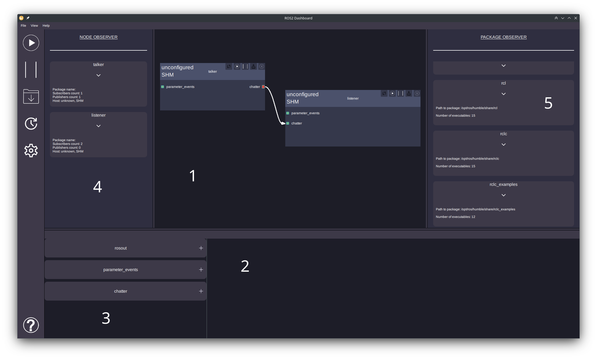

# ROS2Dashboard

This repository contains client side of ROS2Monitor project. 
**Caution!** This is the prototype of the program. 

# Dependencies

In order to build from sources you need to prepare your environment. You have to provide following libraries:

- Qt6
- spdlog
- asio
- nlohmann_json
- QuickQanava
- ROS2 (tested with humble)
- fmt
- spdlog
- PCL >= 1.3
- tomlplusplus
- VTK >= 9.1

To test application in the more easier way you may use AppImage executable in the releases section. 
To be able to see ROS2 nodes you have to setup appropriate values for environment variables:
- ROS_DOMAIN_ID=1;
- ROS_DISCOVERY_SERVER="0.0.0.0:11811"
Having set these variables you should launch daemon program if you not have done it yet.

# Screenshots
**Program UI:**

**sensor_msgs/msg/PointCloud2 message visualization:**

