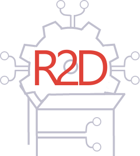

## What is ros2dashboard?
Hi, welcome to the documentation of ros2dashboard!. Firstly, we will explain what is ros2dashboard and what is it for. Then, we will explain how to install it and how to use it. 
Ros2Dashboard it is tool, which has as the main goal to provide a graphical interface to visualize the status of the ROS2 system and provide capabiblites to edit the parameters of the nodes at runtime.
Be aware that this tool is still in VERY EARLY development and it is not ready for production.

The project is devide in two parts: client and server
The server part is system daemon written in rust, which consequently scanning the ROS2 system and providing the information to the client part.
This information includes: currently running nodes, topics, services, etc. By the way, it also provides the information about a local filesystem entities, like ROS2 packages at your ROS2 workspace (I'm ensure, you have one).

## How to install ros2dashboard?
To begin with, you need to have installed the following dependencies: 
- ROS2 (Tested with Humble Hummingbird for now)
- C++20 compatible compiler (Tested with GCC 10.2.0)
- Qt6.5 

The rest of the dependencies will be installed via vcpkg:
```bash
git submodule update --init --recursive
./vcpgk/bootstrap-vcpkg.sh
./vcpkg/vcpkg install
```
To build the project, you need to run the following commands:
```bash
mkdir build && cd build
cmake -DCMAKE_TOOLCHAIN_FILE=../vcpkg/scripts/buildsystems/vcpkg.cmake -DCMAKE_BUILD_TYPE=Release ..
make -j${nproc}
./ros2dashboard
```

## Documentation
All documentation can be found here [docs](https://biblbrox.github.io/ROS2Dashboard/html/index.html).
